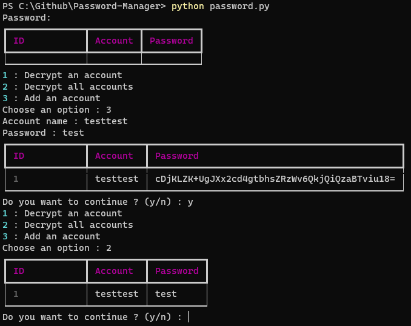

# CLI-PM (Command Line Password Manager)

## ⬇️ Download 


```bash
git clone https://github.com/YungBricoCoop/Password-Manager
cd Password-Manager
pip install -r requirements.txt
```
## ✔️ Usage
First you should run this program in the new Windows Terminal, it will be more beautiful. 

When you run the script it will ask you for your password : 

PS : **You should indicate a strong password that you'll always remember**
```
python password.py
> Password: <Your password>
```
Then you just need to follow what the script will ask you.

## 👍 Result
